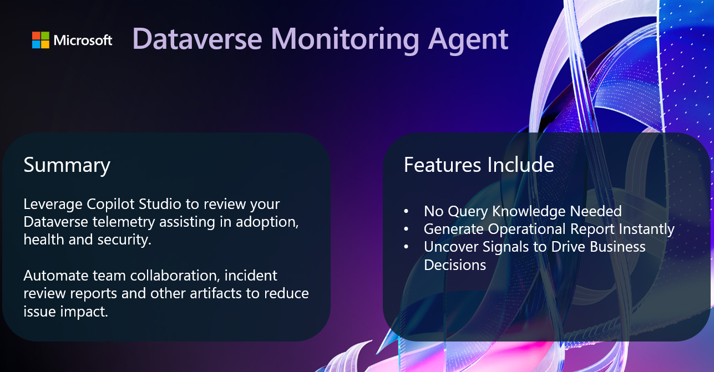
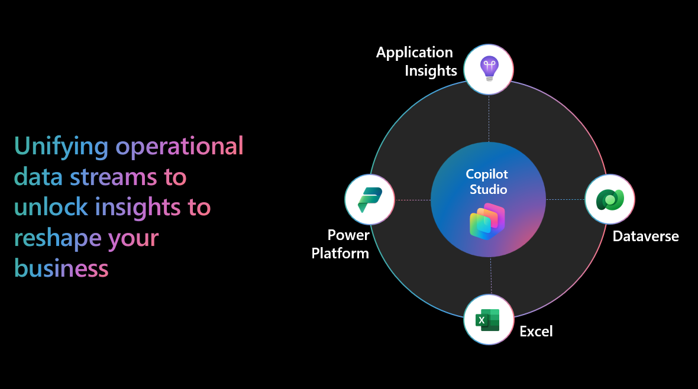

# 🔥 Dataverse Monitoring Agent
Leverage Copilot Studio to review your Dataverse telemetry assisting in adoption, health and security.
This repo houses a sample Copilot Studio agent template. This template agent is designed to fast track a Dataverse monitoring agent. 
Automate team collaboration, incident review reports and other artifacts to reduce issue impact.

## Features Include

- No Query Knowledge Needed
- Generate Operational Report Instantly
- Uncover Signals to Drive Business Decisions

# Getting Started
To get started with the agent, refer to the [Getting Started page](./lab/00_GettingStarted.md) in the lab folder.

# Architecture
